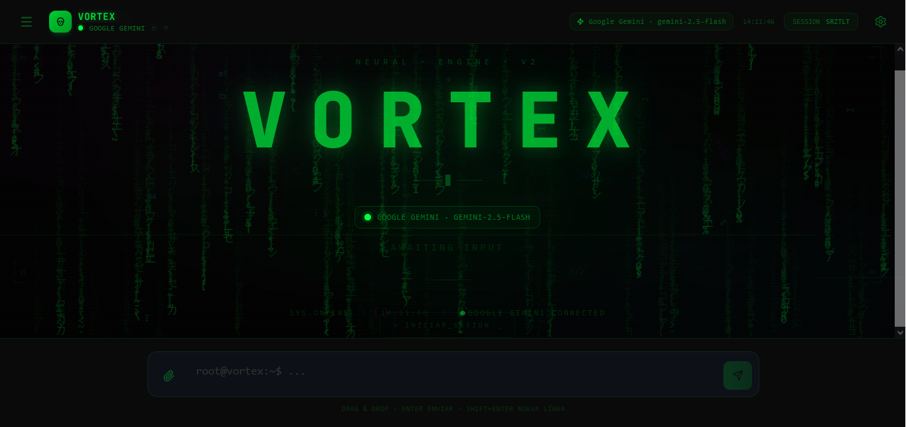

# Chatbot Vortex

[](https://github.com/Victor00128/Chatbot-Vortex/actions/workflows/ci.yml)
[](./LICENSE)



Chatbot Vortex is a chat interface for working with multiple AI providers from a single place. The project lets you try the experience in local mode, connect providers with your own API key, and export conversations straight from the browser.

## Demo

- Live demo: https://chatbot-vortex.vercel.app/
- Default mode: `offline`
- Recommended use today: demos, flow validation, and BYOK testing

## What it offers

- Multiple providers in a single UI: Gemini, Groq, OpenAI, DeepSeek, OpenRouter, and local mode.
- Persistent in-browser history with export to JSON and Markdown.
- Conversation search by title and content from the sidebar.
- Attachments with basic analysis of images, PDFs, ZIPs, code, CSV, JSON, audio, and video.
- Configurable model, temperature, max tokens, and system prompt.
- Accessibility improvements: keyboard navigation, clearer focus states, and reduced motion when the system requests `prefers-reduced-motion`.
- Cancel an in-progress response, with visible status and error notices.

## Stack

- React 19
- TypeScript
- Vite
- Tailwind CSS v4
- Lucide React

## Quick start

Requirements:

- Node.js 18 or higher

Installation:

```bash
git clone https://github.com/Victor00128/Chatbot-Vortex.git
cd Chatbot-Vortex
npm ci
npm run dev
```

Production build:

```bash
npm run build
```

## Available scripts

- `npm run dev`
- `npm run build`
- `npm run preview`
- `npm run lint`
- `npm run typecheck`
- `npm run test`

## Quality

- GitHub Actions CI for `lint`, `typecheck`, `test`, and `build`
- Public changelog in [CHANGELOG.md](CHANGELOG.md)
- Smoke tests for critical chat and file utilities

## Configuration

The app starts in `offline` mode by default. This avoids shipping a preconfigured key and lets you try the interface without touching any API.

If you want to use a real provider:

1. Open the settings button.
2. Choose a provider.
3. Paste your API key.
4. Save and test the connection.

## Security

The current version works with your own API key. When you choose a real provider, the key is used directly from the browser.

That's good for:

- demos
- personal use
- quick flow validation

It is not enough for:

- a multi-user product
- enterprise sales
- real quota control, billing, or abuse prevention

If the project evolves into a multi-user commercial version, the logical next step is to set up a backend or proxy that:

- receives requests from the frontend
- protects the keys
- enforces authentication, rate limits, and observability
- optionally stores history outside the browser

## Structure

```text
src/
├── components/
├── hooks/
├── types/
├── utils/
└── App.tsx
```

## Current status

This version leaves the project in a much more solid state for demos, technical review, and iteration:

- secure configuration by default
- a more consistent interface
- data export
- stronger baseline accessibility
- clearer handling of errors and timeouts

## Recommended next steps

1. Move provider calls to your own backend or proxy that protects the keys.
2. Add user authentication and plans.
3. Store history in a database or IndexedDB, not just `localStorage`.
4. Add analytics, rate limiting, and an admin panel.
5. Prepare a landing page, pricing, and a more complete public demo.

## License

MIT. See the [LICENSE](LICENSE) file.
